# AFF Backend Component Diagram - Routes, Middleware, Controllers, and Services

This diagram shows only the route, authentication and role middleware, controller, and service components inside the AFF Express backend.

```mermaid
flowchart TB
  subgraph backend["AFF Backend - Express.js Application"]
    direction TB

    subgraph routes["Routes - Express API Routers"]
      direction LR

      auth["AuthRoutes<br/>/api/auth"]
      users["UserRoutes<br/>/api/users"]
      food["FoodRoutes<br/>/api/food"]
      reservations["ReservationRoutes<br/>/api/reservations"]
      subscriptions["SubscriptionRoutes<br/>/api/subscriptions"]
      admin["AdminRoutes<br/>/api/admin"]
    end

    authentication["Authentication Middleware"]
    role["Role Middleware"]

    subgraph controllers["Controller - HTTP Request Handlers"]
      direction LR

      authController["AuthController"]
      userController["UserController"]
      foodController["FoodController"]
      reservationController["ReservationController"]
      subscriptionController["SubscriptionController"]
      adminController["AdminController"]
    end

    subgraph services["Service - Business Logic"]
      direction LR

      authService["AuthService"]
      userService["UserService"]
      foodService["FoodService"]
      reservationService["ReservationService"]
      subscriptionService["SubscriptionService"]
      adminService["AdminService"]
    end

    routes -->|"Sends protected requests"| authentication
    authentication -->|"Passes authenticated user"| role
    role -->|"Allows permitted requests"| controllers
    controllers -->|"Calls business logic"| services

  end

  classDef registryComponent fill:#E3F2FD,stroke:#1565C0,color:#1B1B1B,stroke-width:2px;
  classDef routeComponent fill:#FFF3E0,stroke:#EF6C00,color:#1B1B1B,stroke-width:2px;
  classDef middlewareComponent fill:#FCE4EC,stroke:#C2185B,color:#1B1B1B,stroke-width:2px;
  classDef controllerComponent fill:#FFF8E1,stroke:#F9A825,color:#1B1B1B,stroke-width:2px;
  classDef serviceComponent fill:#E8EAF6,stroke:#3949AB,color:#1B1B1B,stroke-width:2px;

  class registry registryComponent;
  class auth,users,food,reservations,subscriptions,admin routeComponent;
  class authentication,role middlewareComponent;
  class authController,userController,foodController,reservationController,subscriptionController,adminController controllerComponent;
  class authService,userService,foodService,reservationService,subscriptionService,adminService serviceComponent;

  style backend fill:#F8FAFC,stroke:#475569,color:#1B1B1B,stroke-width:2px;
  style routes fill:#FFFFFF,stroke:#94A3B8,color:#1B1B1B,stroke-width:1px;
  style controllers fill:#FFFFFF,stroke:#94A3B8,color:#1B1B1B,stroke-width:1px;
  style services fill:#FFFFFF,stroke:#94A3B8,color:#1B1B1B,stroke-width:1px;
```

| Component | Base URL | Responsibility |
|---|---|---|
| `AuthRoutes` | `/api/auth` | Authentication routes, including login and registration. |
| `UserRoutes` | `/api/users` | User account and profile routes. |
| `FoodRoutes` | `/api/food` | Food-listing routes. |
| `ReservationRoutes` | `/api/reservations` | Food-reservation routes. |
| `SubscriptionRoutes` | `/api/subscriptions` | Premium-subscription routes. |
| `AdminRoutes` | `/api/admin` | Administration routes. |

| Middleware | Responsibility |
|---|---|
| `AuthenticationMiddleware` | Checks whether a user is logged in before allowing access to a protected route. |
| `RoleMiddleware` | Checks whether the logged-in user has permission to access a role-protected route. |

| Controller | Responsibility |
|---|---|
| `AuthController` | Handles authentication requests and delegates authentication operations. |
| `UserController` | Handles user account and profile requests. |
| `FoodController` | Handles food-listing requests. |
| `ReservationController` | Handles food-reservation requests. |
| `SubscriptionController` | Handles premium-subscription requests. |
| `AdminController` | Handles administration requests. |

| Service | Responsibility |
|---|---|
| `AuthService` | Contains login and registration rules. |
| `UserService` | Contains user account and profile rules. |
| `FoodService` | Contains food-listing rules. |
| `ReservationService` | Contains food-reservation rules. |
| `SubscriptionService` | Contains premium-subscription rules. |
| `AdminService` | Contains administration rules. |

The base URLs identify backend route groups. Protected routes pass through authentication and, where required, role middleware before reaching the corresponding controller. Controllers pass work to services, where the business rules are handled. Frontend page URLs and individual HTTP endpoints are intentionally omitted.
