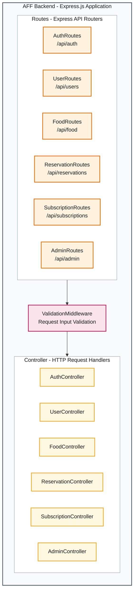

# AFF Backend Component Diagram - Routes, Validation Middleware, and Controllers

This diagram shows only the route, request-validation middleware, and controller components inside the AFF Express backend. Other backend components will be added after their responsibilities have been studied.

| Component | Base URL | Responsibility |
|---|---|---|
| `AuthRoutes` | `/api/auth` | Authentication routes, including login and registration. |
| `UserRoutes` | `/api/users` | User account and profile routes. |
| `FoodRoutes` | `/api/food` | Food-listing routes. |
| `ReservationRoutes` | `/api/reservations` | Food-reservation routes. |
| `SubscriptionRoutes` | `/api/subscriptions` | Premium-subscription routes. |
| `AdminRoutes` | `/api/admin` | Administration routes. |

| Middleware | Responsibility |
|---|---|
| `ValidationMiddleware` | Validates request input and returns validation errors before invalid requests reach a controller. |

| Controller | Responsibility |
|---|---|
| `AuthController` | Handles authentication requests and delegates authentication operations. |
| `UserController` | Handles user account and profile requests. |
| `FoodController` | Handles food-listing requests. |
| `ReservationController` | Handles food-reservation requests. |
| `SubscriptionController` | Handles premium-subscription requests. |
| `AdminController` | Handles administration requests. |

The base URLs identify backend route groups. Route requests pass through request-input validation before reaching the corresponding controller. Frontend page URLs and individual HTTP endpoints are intentionally omitted.
