# AFF Backend Component Diagram

This diagram shows the main request-processing and data-access components inside the AFF Express backend, together with the MongoDB database used to store application data.

```mermaid
flowchart TB
  subgraph backend["AFF Backend - Express.js Application"]
    direction TB

    subgraph routes["Routes - Express API Routers"]
      direction LR

      auth["AuthRoutes<br/>/api/auth"]
      users["UserRoutes<br/>/api/users"]
      food["FoodRoutes<br/>/api/food"]
      reservations["ReservationRoutes<br/>/api/reservations"]
      subscriptions["SubscriptionRoutes<br/>/api/subscriptions"]
      admin["AdminRoutes<br/>/api/admin"]
    end

    authentication["AuthenticationMiddleware"]
    role["RoleMiddleware"]
    errorMiddleware["ErrorMiddleware"]

    subgraph controllers["Controller - HTTP Request Handlers"]
      direction LR

      authController["AuthController"]
      userController["UserController"]
      foodController["FoodController"]
      reservationController["ReservationController"]
      subscriptionController["SubscriptionController"]
      adminController["AdminController"]
    end

    subgraph services["Service - Business Logic"]
      direction LR

      authService["AuthService"]
      userService["UserService"]
      foodService["FoodService"]
      reservationService["ReservationService"]
      subscriptionService["SubscriptionService"]
      adminService["AdminService"]
    end

    subgraph repositories["Repository - Database Operations"]
      direction LR

      userRepository["UserRepository"]
      foodRepository["FoodRepository"]
      reservationRepository["ReservationRepository"]
      subscriptionRepository["SubscriptionRepository"]
    end

    subgraph models["Model - Mongoose Schemas"]
      direction LR

      userModel["User Model"]
      foodModel["FoodListing Model"]
      reservationModel["Reservation Model"]
      subscriptionModel["Subscription Model"]
    end

    routes -->|"Sends protected requests"| authentication
    authentication -->|"Passes authenticated user"| role
    role -->|"Allows permitted requests"| controllers
    controllers -->|"Calls business logic"| services
    services -->|"Requests data operations"| repositories
    repositories -->|"Uses data models"| models
    controllers -.->|"Forwards errors"| errorMiddleware

  end

  models -->|"Reads and writes data"| mongoDatabase[("MongoDB")]

  classDef routeComponent fill:#FFF3E0,stroke:#EF6C00,color:#1B1B1B,stroke-width:2px;
  classDef middlewareComponent fill:#FCE4EC,stroke:#C2185B,color:#1B1B1B,stroke-width:2px;
  classDef controllerComponent fill:#FFF8E1,stroke:#F9A825,color:#1B1B1B,stroke-width:2px;
  classDef serviceComponent fill:#E8EAF6,stroke:#3949AB,color:#1B1B1B,stroke-width:2px;
  classDef repositoryComponent fill:#F3E5F5,stroke:#8E24AA,color:#1B1B1B,stroke-width:2px;
  classDef modelComponent fill:#E0F2F1,stroke:#00897B,color:#1B1B1B,stroke-width:2px;
  classDef databaseComponent fill:#FFEBEE,stroke:#C62828,color:#1B1B1B,stroke-width:2px;

  class auth,users,food,reservations,subscriptions,admin routeComponent;
  class authentication,role,errorMiddleware middlewareComponent;
  class authController,userController,foodController,reservationController,subscriptionController,adminController controllerComponent;
  class authService,userService,foodService,reservationService,subscriptionService,adminService serviceComponent;
  class userRepository,foodRepository,reservationRepository,subscriptionRepository repositoryComponent;
  class userModel,foodModel,reservationModel,subscriptionModel modelComponent;
  class mongoDatabase databaseComponent;

  style backend fill:#F8FAFC,stroke:#475569,color:#1B1B1B,stroke-width:2px;
  style routes fill:#FFFFFF,stroke:#94A3B8,color:#1B1B1B,stroke-width:1px;
  style controllers fill:#FFFFFF,stroke:#94A3B8,color:#1B1B1B,stroke-width:1px;
  style services fill:#FFFFFF,stroke:#94A3B8,color:#1B1B1B,stroke-width:1px;
  style repositories fill:#FFFFFF,stroke:#94A3B8,color:#1B1B1B,stroke-width:1px;
  style models fill:#FFFFFF,stroke:#94A3B8,color:#1B1B1B,stroke-width:1px;
```

| Component | Base URL | Responsibility |
|---|---|---|
| `AuthRoutes` | `/api/auth` | Authentication routes, including login and registration. |
| `UserRoutes` | `/api/users` | User account and profile routes. |
| `FoodRoutes` | `/api/food` | Food-listing routes. |
| `ReservationRoutes` | `/api/reservations` | Food-reservation routes. |
| `SubscriptionRoutes` | `/api/subscriptions` | Premium-subscription routes. |
| `AdminRoutes` | `/api/admin` | Administration routes. |

| Middleware | Responsibility |
|---|---|
| `AuthenticationMiddleware` | Checks whether a user is logged in before allowing access to a protected route. |
| `RoleMiddleware` | Checks whether the logged-in user has permission to access a role-protected route. |
| `ErrorMiddleware` | Catches errors forwarded by controllers and returns a consistent error response. |

| Controller | Responsibility |
|---|---|
| `AuthController` | Handles authentication requests and delegates authentication operations. |
| `UserController` | Handles user account and profile requests. |
| `FoodController` | Handles food-listing requests. |
| `ReservationController` | Handles food-reservation requests. |
| `SubscriptionController` | Handles premium-subscription requests. |
| `AdminController` | Handles administration requests. |

| Service | Responsibility |
|---|---|
| `AuthService` | Contains login and registration rules. |
| `UserService` | Contains user account and profile rules. |
| `FoodService` | Contains food-listing rules. |
| `ReservationService` | Contains food-reservation rules. |
| `SubscriptionService` | Contains premium-subscription rules. |
| `AdminService` | Contains administration rules. |

| Repository | Responsibility |
|---|---|
| `UserRepository` | Performs user database operations. |
| `FoodRepository` | Performs food-listing database operations. |
| `ReservationRepository` | Performs reservation database operations. |
| `SubscriptionRepository` | Performs subscription database operations. |

| Model | Responsibility |
|---|---|
| `User Model` | Defines the MongoDB structure for users. |
| `FoodListing Model` | Defines the MongoDB structure for food listings. |
| `Reservation Model` | Defines the MongoDB structure for reservations. |
| `Subscription Model` | Defines the MongoDB structure for subscriptions. |

| Database | Responsibility |
|---|---|
| `MongoDB` | Stores user, food-listing, reservation, and subscription data. |

The main request path is Routes to Middleware to Controllers to Services to Repositories to Models and finally MongoDB. The dotted arrow to Error Middleware represents the separate path used when a controller forwards an error. Only the Users, Food, Reservations, and Subscriptions modules currently have repository and model components; Auth and Admin do not.
