# AFF Backend Modular Monolith Component Diagram

The AFF backend is one Express application divided into six bounded business modules. Every module has Routes, Controller, Service, DTO, and Interface components. Modules that own persistent data also have a Repository and Model.

Only one arrow in each equivalent set is labelled; matching unlabelled arrows have the same meaning. Public, authenticated, and role-protected paths remain separate because they behave differently.

```mermaid
flowchart TB
  subgraph backend["AFF Backend - Express.js Modular Monolith"]
    direction TB

    subgraph authModule["Auth Module"]
      direction TB
      authRoutes["Routes<br/>/api/auth"]
      authController["Controller"]
      authService["Service"]
      authDto["DTO"]
      authInterface["Interface"]

      authController -->|"Business logic"| authService
      authController -.->|"Shapes response"| authDto
      authInterface -->|"Exposes operations"| authService
    end

    subgraph usersModule["Users Module"]
      direction TB
      userRoutes["Routes<br/>/api/users"]
      userController["Controller"]
      userService["Service"]
      userRepository["Repository"]
      userModel["Model"]
      userDto["DTO"]
      userInterface["Interface"]

      userController --> userService
      userService -->|"Data operations"| userRepository
      userRepository -->|"Uses model"| userModel
      userController -.-> userDto
      userInterface --> userService
    end

    subgraph foodModule["Food Module"]
      direction TB
      foodRoutes["Routes<br/>/api/food"]
      foodController["Controller"]
      foodService["Service"]
      foodRepository["Repository"]
      foodModel["Model"]
      foodDto["DTO"]
      foodInterface["Interface"]

      foodController --> foodService
      foodService --> foodRepository
      foodRepository --> foodModel
      foodController -.-> foodDto
      foodInterface --> foodService
    end

    subgraph sharedMiddleware["Middleware"]
      direction LR
      authentication["auth.middleware"]
      role["role.middleware"]
      errorMiddleware["error.middleware"]

      authentication -->|"Role check when required"| role
      role ~~~ errorMiddleware
    end

    subgraph reservationsModule["Reservations Module"]
      direction TB
      reservationRoutes["Routes<br/>/api/reservations"]
      reservationController["Controller"]
      reservationService["Service"]
      reservationRepository["Repository"]
      reservationModel["Model"]
      reservationDto["DTO"]
      reservationInterface["Interface"]

      reservationController --> reservationService
      reservationService --> reservationRepository
      reservationRepository --> reservationModel
      reservationController -.-> reservationDto
      reservationInterface --> reservationService
    end

    subgraph subscriptionsModule["Subscriptions Module"]
      direction TB
      subscriptionRoutes["Routes<br/>/api/subscriptions"]
      subscriptionController["Controller"]
      subscriptionService["Service"]
      subscriptionRepository["Repository"]
      subscriptionModel["Model"]
      subscriptionDto["DTO"]
      subscriptionInterface["Interface"]

      subscriptionController --> subscriptionService
      subscriptionService --> subscriptionRepository
      subscriptionRepository --> subscriptionModel
      subscriptionController -.-> subscriptionDto
      subscriptionInterface --> subscriptionService
    end

    subgraph adminModule["Admin Module"]
      direction TB
      adminRoutes["Routes<br/>/api/admin"]
      adminController["Controller"]
      adminService["Service"]
      adminDto["DTO"]
      adminInterface["Interface"]

      adminController --> adminService
      adminController -.-> adminDto
      adminInterface --> adminService
    end

    authRoutes -->|"Public"| authController
    foodRoutes -->|"Public listing read"| foodController

    userRoutes -->|"Protected"| authentication
    foodRoutes --> authentication
    reservationRoutes --> authentication
    subscriptionRoutes --> authentication
    adminRoutes --> authentication

    authentication -->|"Authenticated"| userController
    role --> foodController
    role --> reservationController
    role --> subscriptionController
    role --> adminController

    authController -.->|"Errors"| errorMiddleware
    userController -.-> errorMiddleware
    foodController -.-> errorMiddleware
    reservationController -.-> errorMiddleware
    subscriptionController -.-> errorMiddleware
    adminController -.-> errorMiddleware

    authService -.->|"Module call"| userInterface
    reservationService -.-> foodInterface
    subscriptionService -.-> userInterface
  end

  userModel -->|"Persists"| mongoDatabase[("MongoDB")]
  foodModel --> mongoDatabase
  reservationModel --> mongoDatabase
  subscriptionModel --> mongoDatabase

  classDef routeComponent fill:#FFF3E0,stroke:#EF6C00,color:#1B1B1B,stroke-width:2px;
  classDef middlewareComponent fill:#FCE4EC,stroke:#C2185B,color:#1B1B1B,stroke-width:2px;
  classDef controllerComponent fill:#FFF8E1,stroke:#F9A825,color:#1B1B1B,stroke-width:2px;
  classDef serviceComponent fill:#E8EAF6,stroke:#3949AB,color:#1B1B1B,stroke-width:2px;
  classDef interfaceComponent fill:#E3F2FD,stroke:#1565C0,color:#1B1B1B,stroke-width:2px;
  classDef dtoComponent fill:#ECEFF1,stroke:#546E7A,color:#1B1B1B,stroke-width:2px;
  classDef repositoryComponent fill:#F3E5F5,stroke:#8E24AA,color:#1B1B1B,stroke-width:2px;
  classDef modelComponent fill:#E0F2F1,stroke:#00897B,color:#1B1B1B,stroke-width:2px;
  classDef databaseComponent fill:#FFEBEE,stroke:#C62828,color:#1B1B1B,stroke-width:2px;

  class authRoutes,userRoutes,foodRoutes,reservationRoutes,subscriptionRoutes,adminRoutes routeComponent;
  class authentication,role,errorMiddleware middlewareComponent;
  class authController,userController,foodController,reservationController,subscriptionController,adminController controllerComponent;
  class authService,userService,foodService,reservationService,subscriptionService,adminService serviceComponent;
  class authInterface,userInterface,foodInterface,reservationInterface,subscriptionInterface,adminInterface interfaceComponent;
  class authDto,userDto,foodDto,reservationDto,subscriptionDto,adminDto dtoComponent;
  class userRepository,foodRepository,reservationRepository,subscriptionRepository repositoryComponent;
  class userModel,foodModel,reservationModel,subscriptionModel modelComponent;
  class mongoDatabase databaseComponent;

  style backend fill:#F8FAFC,stroke:#475569,color:#1B1B1B,stroke-width:3px;
  style sharedMiddleware fill:#FFF7F9,stroke:#C2185B,color:#1B1B1B,stroke-width:2px;
  style authModule fill:#FFFFFF,stroke:#1565C0,color:#1B1B1B,stroke-width:2px;
  style usersModule fill:#FFFFFF,stroke:#1565C0,color:#1B1B1B,stroke-width:2px;
  style foodModule fill:#FFFFFF,stroke:#1565C0,color:#1B1B1B,stroke-width:2px;
  style reservationsModule fill:#FFFFFF,stroke:#1565C0,color:#1B1B1B,stroke-width:2px;
  style subscriptionsModule fill:#FFFFFF,stroke:#1565C0,color:#1B1B1B,stroke-width:2px;
  style adminModule fill:#FFFFFF,stroke:#1565C0,color:#1B1B1B,stroke-width:2px;
```

## Reading the Diagram

- Blue boundaries are business modules; the pink boundary groups shared middleware.
- Solid arrows show normal request or data flow. Dotted arrows show errors, DTO shaping, or cross-module calls.
- Interfaces expose module operations. Other modules call the Interface rather than the target Service directly.
- Auth and Admin currently own no Repository or Model.

## Modules and Request Access

| Module | Base path | Current access path | Persistence |
|---|---|---|---|
| Auth | `/api/auth` | Public login and registration | None; uses `UserInterface` |
| Users | `/api/users` | Authentication required; no role guard | User repository and model |
| Food | `/api/food` | Public reads; donor-protected creation | Food repository and model |
| Reservations | `/api/reservations` | Recipient role required | Reservation repository and model |
| Subscriptions | `/api/subscriptions` | Recipient role required | Subscription repository and model |
| Admin | `/api/admin` | Admin role required | None currently |

## Actual Cross-Module Calls

| Caller | Target Interface | Purpose |
|---|---|---|
| `AuthService` | `UserInterface` | Registration and login user access |
| `ReservationService` | `FoodInterface` | Listing availability and reservation status |
| `SubscriptionService` | `UserInterface` | User lookup and premium status |

The source also contains a direct `AuthDTO -> UserDTO` dependency. It is documented rather than drawn to avoid another crossing arrow and should be reviewed if strict module isolation is required.
