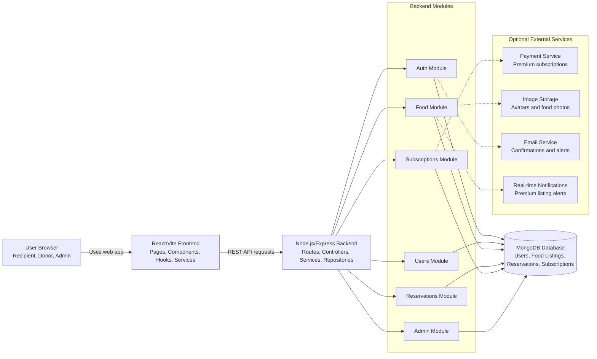

# AFF Container Diagram

The user works in the browser through the React/Vite frontend. The frontend calls the Express backend through REST APIs. The backend is a modular monolith: each business module owns its route/controller/service/repository/model style files, and modules talk to each other through interfaces where needed.

MongoDB stores the application data. Optional external services are separated as integrations so the team can add payment, image storage, email, or real-time notification providers without spreading vendor-specific code through business modules.
