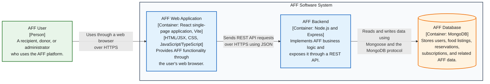

# AFF Container Diagram

Proposed architecture — Milestone 1

| Colour | Meaning |
|---|---|
| Green | Person using the system |
| Blue | Application container inside AFF |
| Orange | Database container inside AFF |
| Grey boundary | AFF software system boundary |

The AFF User uses the React web application in a browser. The web application sends REST API requests over HTTPS using JSON, and the backend reads and writes AFF data in MongoDB. Internal React components and backend modules are intentionally omitted from this container-level view.
