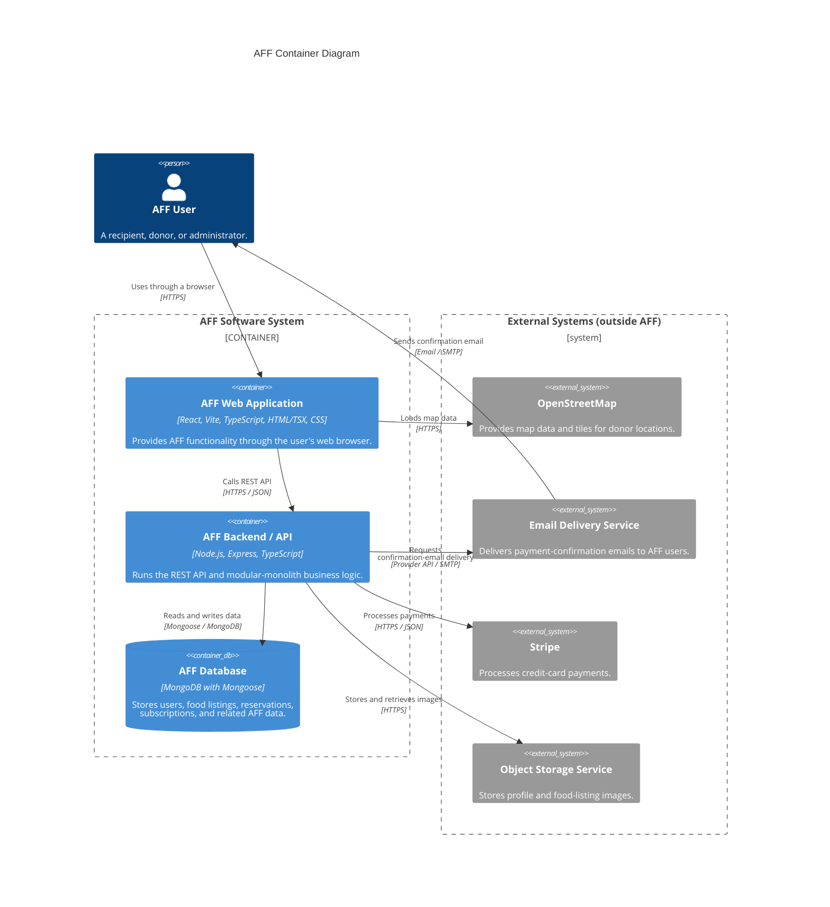

# AFF Container Diagram

Proposed container architecture for the AFF system. AFF is deployed as a React web application, one Express modular-monolith backend, and MongoDB.

## External-system decisions

The project has four planned external-system dependencies, not only Stripe and OpenStreetMap:

| External system | Requirement or design reason | Directly communicating AFF container |
|---|---|---|
| Stripe | Credit-card payments for priced food orders and premium subscriptions (SRS 5.2.3 and 6.2.1) | AFF Backend/API |
| OpenStreetMap | Displaying donor locations on a map (SRS 5.3.4) | AFF Web Application |
| Email Delivery Service | Successful-payment email notification delivered to the AFF user (SRS 6.1.2) | AFF Backend/API |
| Object Storage Service | Uploaded profile and food-listing images (SRS 3.2.1 and the planned storage integration) | AFF Backend/API |

External systems should connect to the container that directly communicates with them, not automatically to the backend. In this design, Stripe, email delivery, and object storage are backend integrations. OpenStreetMap connects to the web application because the browser loads map data for display. If map geocoding is later implemented by the backend, an additional Backend/API to OpenStreetMap relationship should be added.

The external-systems boundary is a visual grouping only; it does not imply that the four providers share ownership or infrastructure.

The email flow is shown in two stages: the Backend/API requests delivery from the provider, and the provider sends the confirmation email to the AFF user. The delivery label is offset from the arrow to keep the long relationship leg readable.

Real-time in-app notifications are AFF functionality rather than a separate external system. Access to the user's current location is supplied by the browser's geolocation capability, so it is described inside the web container instead of being shown as another software system.

## Shape and notation choices

The diagram uses C4 container notation. A one-shape-per-row layout creates a top-to-bottom AFF flow, while the two-boundary row places the external-systems lane to the right. Relationship-label offsets separate the three backend integration descriptions.

| Representation | Meaning |
|---|---|
| Person node | AFF user above and outside the system boundary |
| Container box | Independently running AFF application or API container |
| Database cylinder | MongoDB data store |
| External-system box | Third-party system outside AFF |
| Software-system boundary | Containers owned and deployed as part of AFF |

Browser-window and terminal symbols, as seen in one reference example, are optional decorations. The C4 person, container, database, external-system, and boundary shapes carry the architectural meaning required for this diagram.
